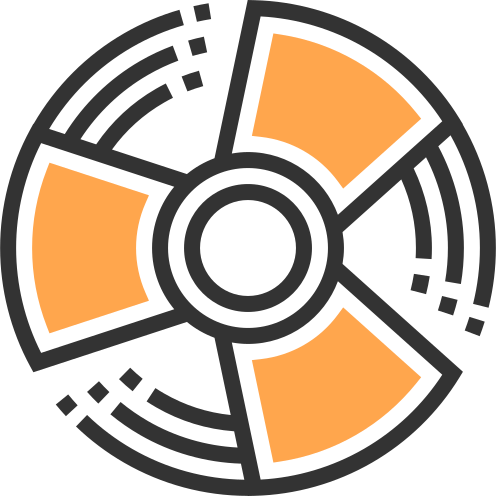

# Dwell

RamHacks 2018, this is a project that uses machine learning and data visualization to gamify job searching and home ownership.

# Example
The python module can be used via command-line arguments.
This requires installing deepchem, and all it's dependencies

calling `'python graphConvolution.py -h'` will give information
about the command-line arguments
example python call:
`'python graphConvolution_BBBdata.py --filename 'finaldata.csv'`
`--split_method='index'`
                                         `--training_fraction 0.6` 
                                         `--testing_fraction 0.2`
                                         `--validation_fraction 0.2`
                                         `--confusion_matrix`
                                         `--split 0.5 --generate'`

Note: any data for training or predicting must be located in the 'data' directory.
Note: data must be in the csv format 

# Try it!
Take a look at our Beta web app [HERE!](https://8080-dot-3803299-dot-devshell.appspot.com/)
